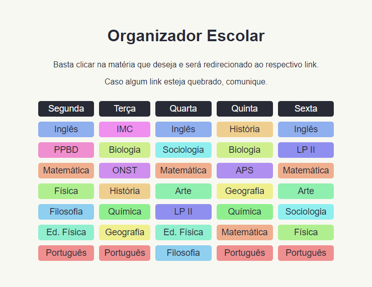

<h1 align="center">Welcome to School Organizer 👋</h1>

A online school schedule management built with vanilla javascript!

  
 

<h3 align="center">
  <a href="https://apolofreitas.github.io/school-organizer/">
    ✨ School Organizer Website
  </a>
</h3>

 

## 💻 About

In this project, a web system for school schedule management was created, due to the need that arose during the pandemic, it kept around 50 people daily during the month of operation.

This school schedule organizer was a really simple project, I created because I was learning the fundamentals of web development and I wanted to test my knowledge.

Due to the need that arose during the pandemic my school started giving classes online using [Google Meet](https://meet.google.com/), the problem was that for each school time slot it was provided a new link for the students watch the class. The large amount of links gave the idea to start this project.

The website gives a timetable and by clicking the time slot the user is redirected to the respective class. I made the hole timetable be dynamic generated by javascript, the idea behind that for the repo be able to be forked and utilized by other people.

The most amazing part was seeing my colleges using the site, during the month of operation it kept around 50 people using it daily. It gave the experience to know how it is to have constant feedback and keep improving a application

## 🚀 Technologies

- HTML
- CSS
- Vanilla Javascript

## 🤔 Getting started

1. Clone this repository.
2. Start coding!

## 🤝 Contributing

Contributions, issues and feature requests are welcome! Feel free to check [issues page](https://github.com/apolofreitas/school-organizer/issues).

## 📝 License

Copyright © 2021 [Apolo Freitas](https://www.linkedin.com/in/apolofreitas). 
This project is [MIT](LICENSE) licensed.
